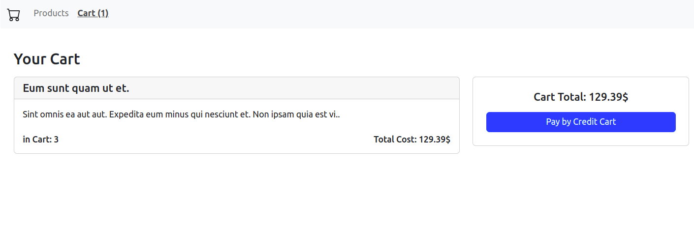

# shopping-cart

Build a Shopping Cart with Vue 3, Vue Router, & VueX

---
## Screenshots



---

## Project Setup

```sh
npm install
```

### Compile and Hot-Reload for Development

```sh
npm run dev
```

### Compile and Minify for Production

```sh
npm run build
```

----- 
Need helps? Reach me out

> Email: soulaimaneyh07@gmail.com

> Linkedin: soulaimane-yahya

All the best :beer:
